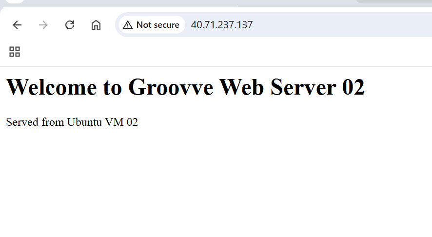
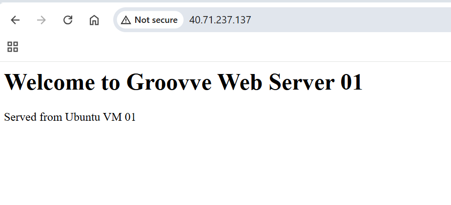
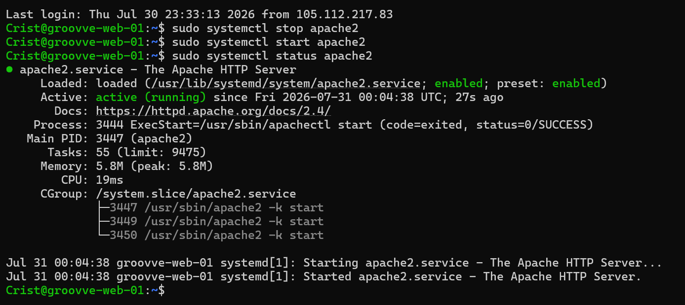
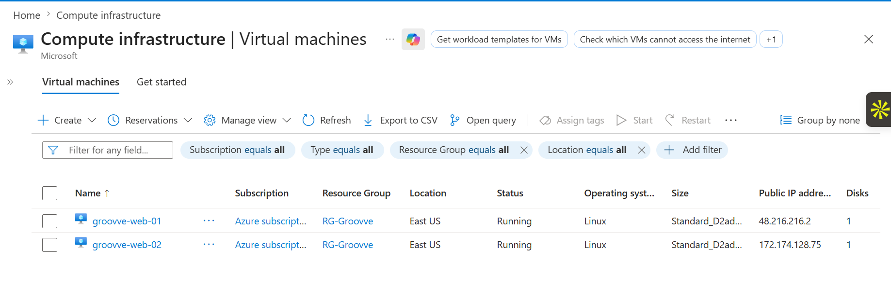
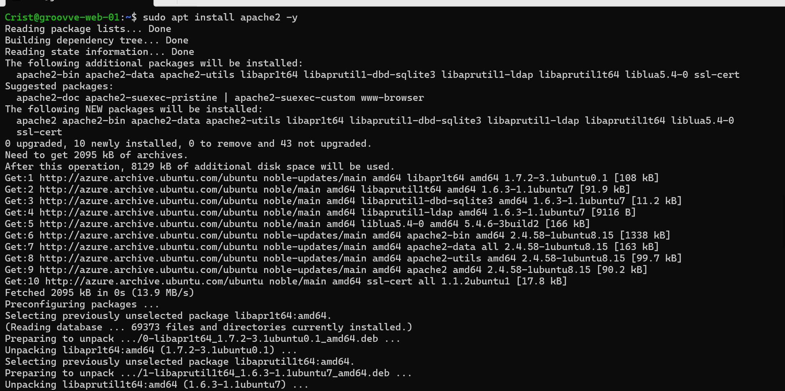
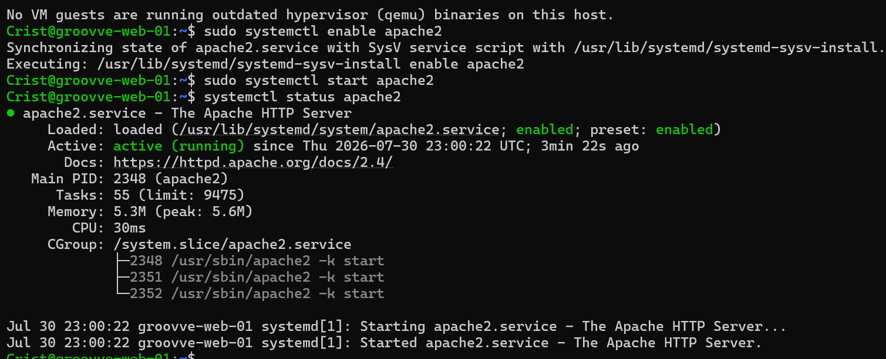
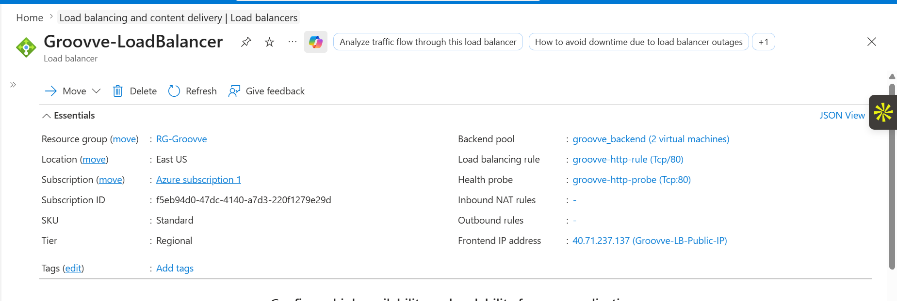
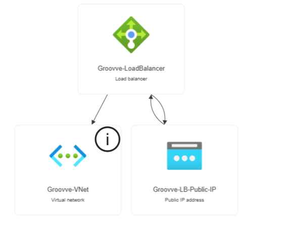

# Groovve Azure Load Balancer with Highly Available Apache Web Servers

## Project Overview

This project demonstrates a highly available web hosting architecture built on Microsoft Azure.

Groovve hosts a public website using two Ubuntu Linux web servers behind an Azure Load Balancer. The solution provides traffic distribution, health monitoring, and automatic failover if one web server becomes unavailable.

## Architecture

```
                         Internet
                            |
                            |
              Groovve Azure Load Balancer
                  Public IP: 40.71.237.137
                            |
              -----------------------------
              |                           |
        groovve-web-01              groovve-web-02
        Ubuntu 24.04                Ubuntu 24.04
        Apache Web Server           Apache Web Server
              |                           |
 Welcome to Groovve Web 01     Welcome to Groovve Web 02
```

## Azure Resources

### Resource Group

```
RG-Groovve-LoadBalancer
```

### Virtual Network

```
Groovve-VNet
```

Address Space:

```
10.50.0.0/16
```

Subnet:

```
Web-Subnet
10.50.1.0/24
```

---

# Virtual Machines

## Web Server 01

Name:

```
groovve-web-01
```

Operating System:

```
Ubuntu 24.04 LTS
```

Web Server:

```
Apache2
```

Website:

```
Welcome to Groovve Web Server 01
```

---

## Web Server 02

Name:

```
groovve-web-02
```

Operating System:

```
Ubuntu 24.04 LTS
```

Web Server:

```
Apache2
```

Website:

```
Welcome to Groovve Web Server 02
```

---

# Azure Load Balancer Configuration

## Frontend IP

```
Groovve-LB-IP
```

Public IP:

```
40.71.237.137
```

## Backend Pool

```
groovve_backend
```

Backend Servers:

```
groovve-web-01
groovve-web-02
```

## Health Probe

Name:

```
groovve-http-probe
```

Configuration:

```
Protocol: HTTP
Port: 80
Path: /
```

## Load Balancing Rule

```
Name: groovve-http-rule

Frontend Port: 80

Backend Port: 80

Protocol: TCP
```

---

# Deployment Process

## Install Apache on Ubuntu Servers

```bash
sudo apt update

sudo apt install apache2 -y

sudo systemctl enable apache2

sudo systemctl start apache2
```

Check Apache:

```bash
sudo systemctl status apache2
```

---

# Testing

## Traffic Distribution Test

The Load Balancer successfully distributed traffic between both backend servers.

### Web Server 01



### Web Server 02



---

# High Availability Failover Test

To simulate a server failure, Apache was stopped on Web Server 01:

```bash
sudo systemctl stop apache2
```

Azure Load Balancer health probes detected that Web Server 01 was unavailable and automatically redirected traffic to Web Server 02.

Result:

```
Welcome to Groovve Web Server 02
Served from Ubuntu VM 02
```



Apache was restored:

```bash
sudo systemctl start apache2
```

Web Server 01 automatically returned to the backend pool after passing health checks.

---

# Project Screenshots

## Azure Virtual Machines



## Apache Installation



## Apache Service Status



## Azure Load Balancer



## Architecture Diagram



---

# Skills Demonstrated

* Microsoft Azure Load Balancer
* Azure Networking
* Virtual Networks (VNet)
* Linux Server Administration
* Ubuntu 24.04
* Apache Web Server Deployment
* Backend Pools
* Health Probes
* High Availability Architecture
* Fault Tolerance Testing
* Cloud Infrastructure Documentation